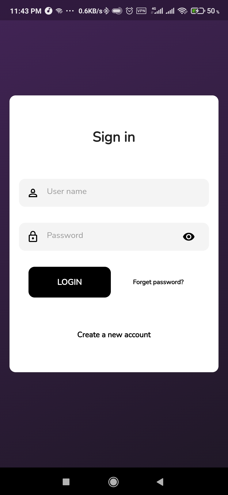
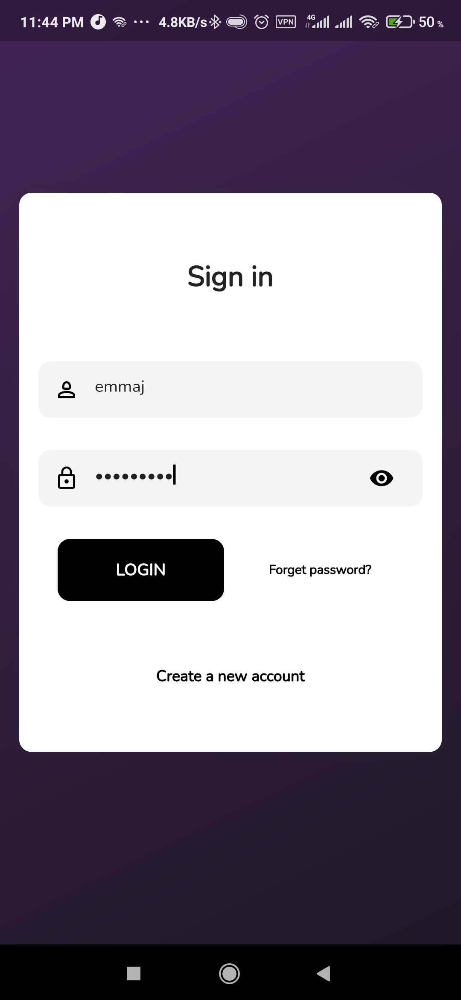
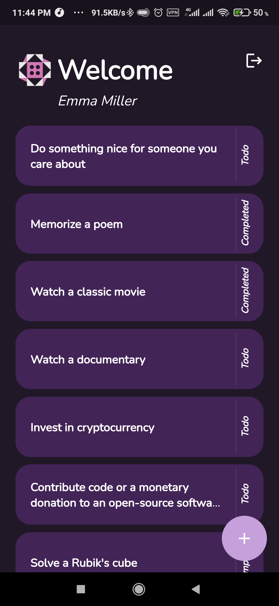
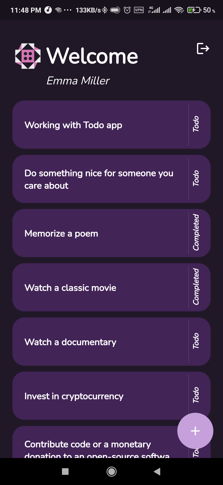
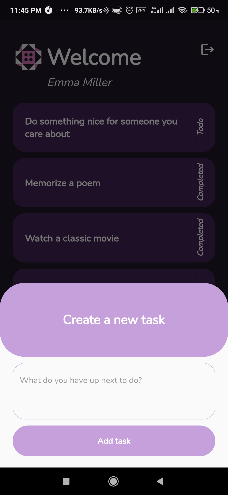
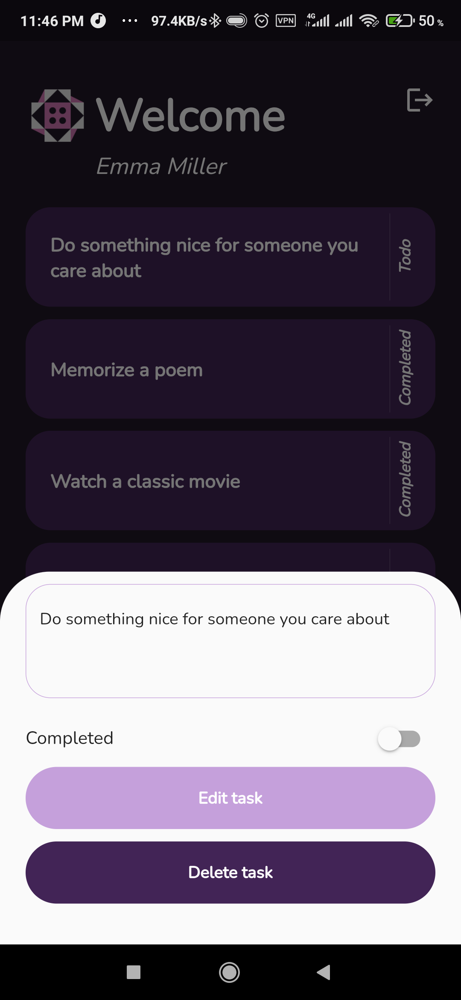

# todo_app

## Table of Contents

- [Overview](#overview)
- [Design Decisions](#design-decisions)
- [Getting Started](#getting-started)

*********************************************************************************

## Overview

todo_app is a cross-platform mobile application built using Flutter. It provides users with a seamless and intuitive experience for managing their daily tasks.

*********************************************************************************

## Design Decisions

### User Interface

- **Minimalist Design**: The app features a clean, minimalist design to ensure that users can focus on their tasks without unnecessary distractions to allow users (add, update ,delete, view) thier tasks in a simple way.
- **Custom Animations**: Smooth transitions and subtle animations were incorporated to improve the user experience. Custom animations were implemented using Flutter's animation framework.

### Architecture

- **Bloc(cubit) for State Management**: Chose the Bloc package for state management due to its efficiency. This decision was based on the need for a scalable solution that could handle the app’s growth.
- **Modular Code Structure**: Organized the code into modules to ensure maintainability and scalability. Each feature has its own directory, encapsulating its logic, widgets, screens and models.

*********************************************************************************

## Getting Started

Before you begin, ensure you have met the following requirements:
- **Flutter SDK**: The flutter sdk that working with this project is 3.22.1
- **Dart SDK**: The dart sdk that working with this project is 3.4.1

*********************************************************************************

## Installation

Follow these steps to get the project up and running:
1. git clone https://github.com/yourusername/my-flutter-app.git
2. cd todo_app
3. flutter pub get
4. dart run build_runner build --delete-conflicting-outputs
5. flutter run

*********************************************************************************

## Screenshots

